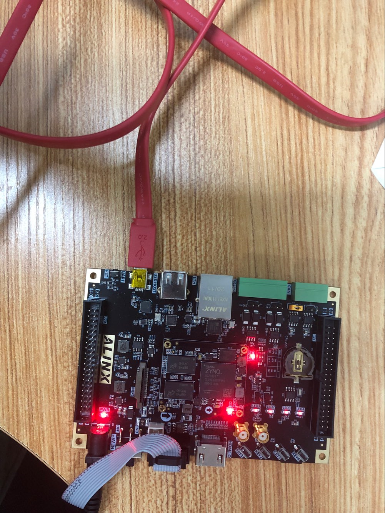
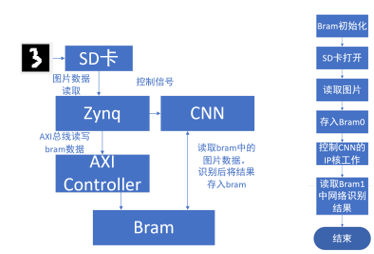

# CNN_ZYNQ_HLS
Using HLS to realize CNN based on ZYNQ

## Objectives

1.Project Summary:The purpose of the design is to use CNN to realize handwritten digit recognition on zynq board. It mainly involves the following three parts

(1) The design of CNN network in tensorflow and the training of minsit handwritten data set;

(2) CNN implementation and hardware acceleration in HLS;

(3) The whole system is built in vivado to realize the data transmission among SD card, Bram and CNN IP.

2.Tool version:

Vivado 2018.3、Vivado HLS 2018.3、Vivado SDK 2018.3、Putty 0.74.

3.Member：Tianhai Lu、Zuxiang Wen、Tongtong Dong

4.Chip：xc7z020clg400-1   
  Device: SD Card 16GB
  
5.Introduction to the record:vivado project file in memory folder and the CNN HLS file  in the cnnhls folder

6.Photos of works：
    

    
    

    

    <i>Getting Started view of Vivado-HLS</i>
    

	

    
    

    

    <i>Getting Started view of Vivado-HLS</i>
    

